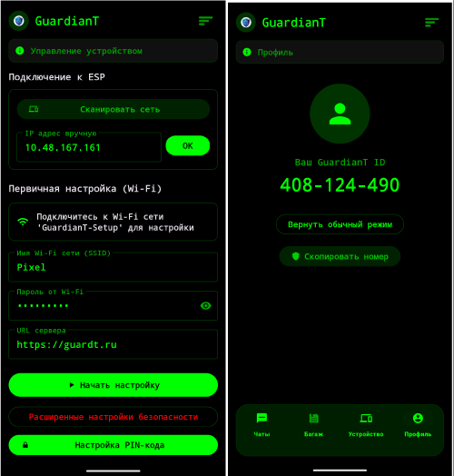
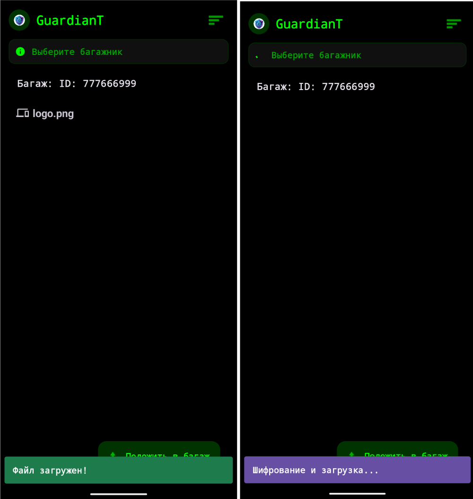
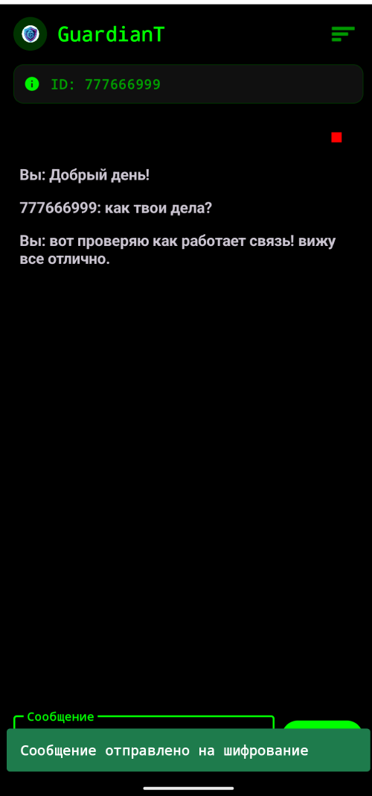
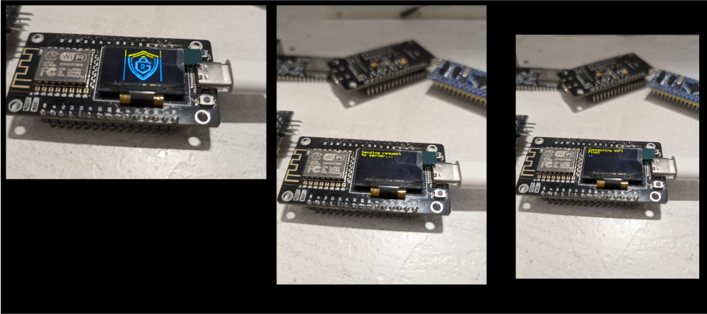
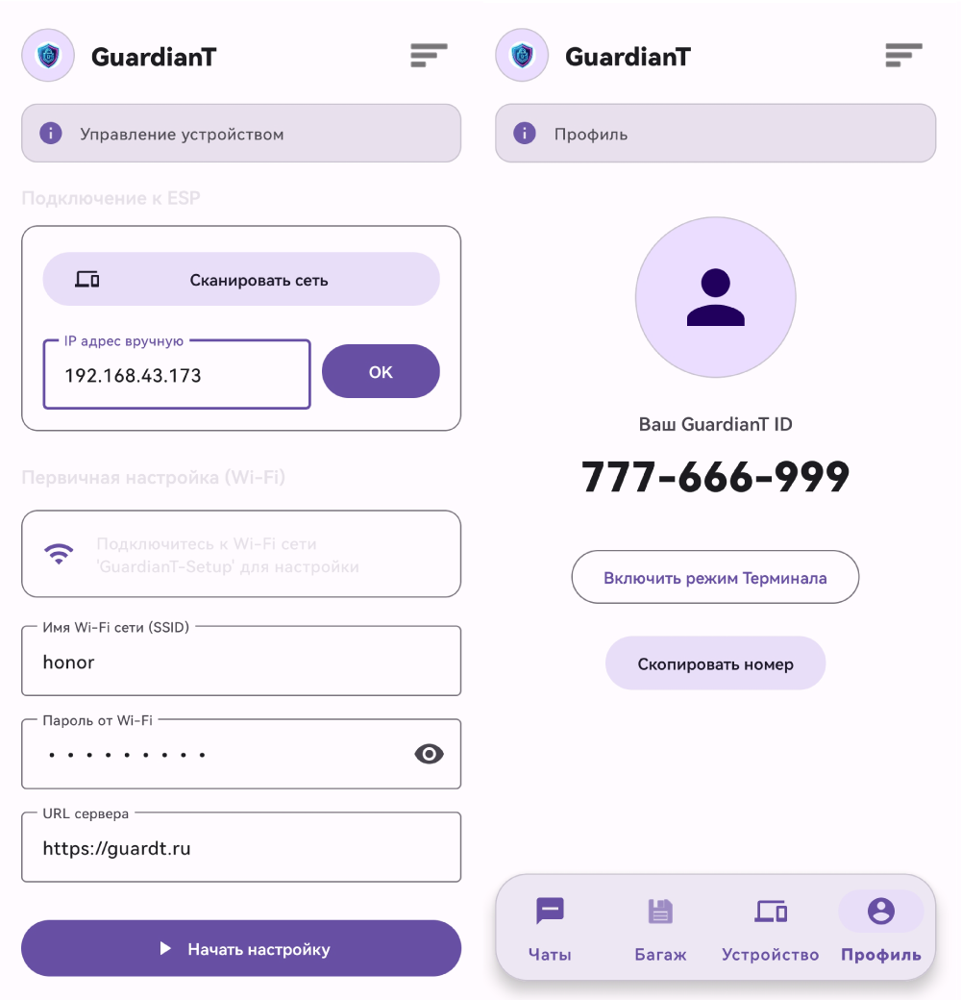
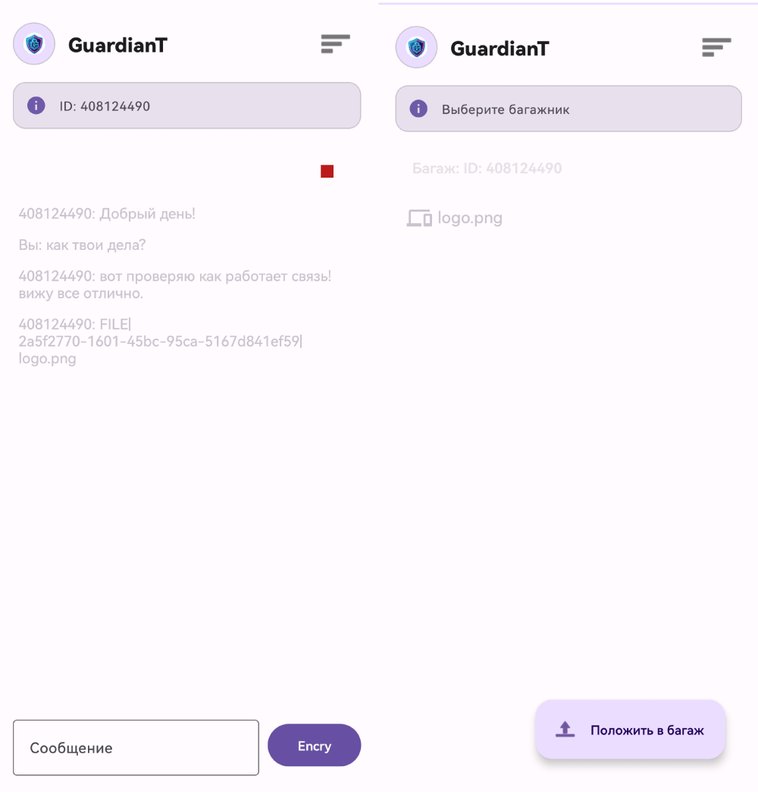

  

# GuardianT Ecosystem

**Privacy. Sovereignty. Hardware Security.**

GuardianT is an open-source secure communication ecosystem that combines a physical hardware key, a mobile application, and a self-hosted server to ensure absolute privacy.

## Project Structure

This repository contains the source code for all components of the GuardianT ecosystem:

*   **[📂 server/](./server)** - The backend server (FastAPI). "Blind courier" architecture.
*   **[📂 android/](./android)** - The Android mobile application (Kotlin).
*   **[📂 firmware/](./firmware)** - Firmware for the hardware key (ESP8266/ESP32).

## Gallery

| Mobile App | Hardware |
|:---:|:---:|
|  |  |
|  |  |

## Getting Started

To deploy the full ecosystem:

1.  **Server:** Set up your own VDS or local server using the code in `server/`.
2.  **Hardware:** Flash your ESP device using the code in `firmware/`.
3.  **App:** Build and install the Android app from `android/`.

## License

This project is distributed under a dual-license model:

*   **Software (Server & App):** GNU Affero General Public License v3 (AGPL-3.0)
*   **Hardware (Schematics & Firmware):** CERN Open Hardware Licence v2 - Strongly Reciprocal (CERN-OHL-S)

See the LICENSE file for the full legal text and disclaimer.

---

# Экосистема GuardianT

**Приватность. Суверенитет. Аппаратная защита.**

GuardianT — это экосистема защищенной связи с открытым исходным кодом, которая объединяет физический аппаратный ключ, мобильное приложение и собственный сервер для обеспечения абсолютной конфиденциальности.

## Структура проекта

Этот репозиторий содержит исходный код для всех компонентов экосистемы GuardianT:

*   **📂 server/** - Бэкенд-сервер (FastAPI). Архитектура "Слепой курьер".
*   **📂 android/** - Мобильное приложение для Android (Kotlin).
*   **📂 firmware/** - Прошивка для аппаратного ключа (ESP8266/ESP32).

## Галерея

| Интерфейс | Устройство |
|:---:|:---:|
|  |  |

## Начало работы

Чтобы развернуть полную экосистему:

1.  **Сервер:** Настройте свой собственный VDS или локальный сервер, используя код из папки `server/`.
2.  **Железо:** Прошейте устройство ESP, используя код из папки `firmware/`.
3.  **Приложение:** Соберите и установите Android-приложение из папки `android/`.

## Лицензия

Этот проект распространяется по модели двойного лицензирования:

*   **Программное обеспечение (Сервер и Приложение):** GNU Affero General Public License v3 (AGPL-3.0)
*   **Аппаратное обеспечение (Схемы и Прошивка):** CERN Open Hardware Licence v2 - Strongly Reciprocal (CERN-OHL-S)

Смотрите файл LICENSE для полного юридического текста и отказа от ответственности.

---
*Copyright (C) 2026 GuardianT Project*
